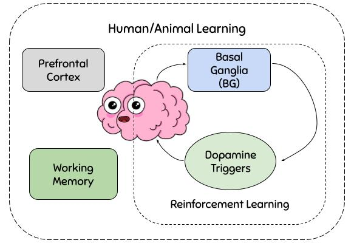

# CS698R-Project-Foraging-in-Replenishing-Patches-7

**Picture:** *A schematic for Human/Animal Learning process. (missing working memory component in RL designs)*

> **Abstract:** *Classical RL models lack in encoding behavioural variance present
in the learning process of humans. We explore the effect of the working memory module on learning behaviour. We propose an RL model which combines the classical RL methods with a working memory component to study its effects on Foraging tasks. We use three variants of foraging with replenishing patches task for our experiments and show the performance of various RL algorithms on them. We further propose a mathematical model that combines the Working Memory component with the RL framework and explain its plausibility in detail. Moreover, we also do a detailed ablation analysis of the proposed mathematical model describing each module’s impacts on performance.*

## Requirements
- We use [OpenAI Gym](https://gym.openai.com) to create a custom environment for the foraging with replinishing patches task.

- We use [OpenCV](https://opencv.org) (opencv-python) for rendering the environment in manual play mode.

- We use [PyTorch](https://pytorch.org/) and [Stable-Baselines3](https://stable-baselines3.readthedocs.io/en/master/) for training the Deep RL agent.

      pip install requirements.txt

## OpenAI Gym Environment
- Testing the registered openai gym environment 

		python registration_test.py

- Manual Testing

		python gym-env\gym_env\envs\foraging_replenishing_patches.py --manual_play --block_type=1

    * Manual play actions: 
    
        * Jump between bushes: Press num keys 0-7 
        * Harvest: Press "h"
        * Quit Game: Press "q"

## Random Agent on Foraging Environment 
 
</img>

## Demo 

Demo run of trained PPO agent on Block 3 of the environment available at [demo](assets/demo_PPO.gif)

## Experiments

> Modified Marginal Value Theorem [[.py]](./agents/MVT) [[jupyter notebooks]](notebooks/MVT)

> Multi-Armed Bandit [[.py]](agents/MAB) [[jupyter notebooks]](notebooks/MAB)

> Deep RL methods [[.py]](agents/DRL) [[jupyter notebooks]](notebooks/DRL)

> MDP and Human Forgetful Behaviour Modelling [[.py]](agents/MDP) [[jupyter notebooks]](agents/MDP)

## Results 

| Method | Reward in Block 1 | Reward in Block 3
| :-----       | :---              | :-----   
| MVT (with replenishment) | 19983.5 | 23215.8
| Multi Armed Bandit (Decaying Epsilon Greedy) | 17199 | 22102.2
| SARSA |   15842 | 20999
| Q Learning | 18814.7 | 25732
| Deep RL (PPO) |   11610.9 | 16104

## Reports

The detailed reports and presentations for this project can be found below:

> Milestone-1 Submission [[Presentation]](docs/Milestone-1-Submission/CS698R-Project-Presentation-7.pdf) [[Report]](docs/Milestone-1-Submission/CS698R-Project-Report-7.pdf)

> Final Submission [[Presentation]](docs/Final-Submission/CS698R-Project-Presentation-7.pdf) [[Report]](docs/Final-Submission/CS698R-Project-Report-7.pdf)

## Authors

* Abhinav Joshi
* Samrudh B Govindraj
* Archi Gupta
* Shiven Tripathi

## Acknowledgement

* We thank Prof. Ashutosh Modi for providing us the opportunity to learn about RL algorithms through this course and the project.

* We thank Prof. Arjun Ramakrishnan for the project ideas and and helping us understand the human behavior modelling with reinforcement learning.

* We thank Kshitij, our project mentor for helping us with the solution approaches and guiding and clarifying our doubts about the environment.

* We thank Shubham, our TA for helping us with the logistics and providing valuable inputs to the project.
